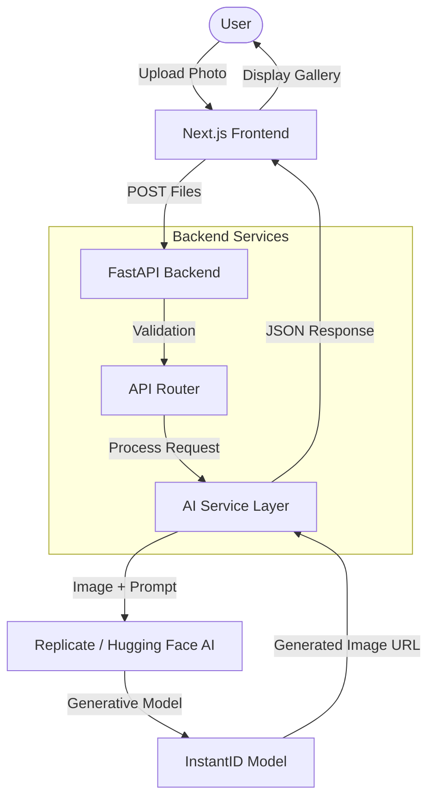

# Pickabook - AI Personalization Engine

**Pickabook** is a magical web application that personalizes storybooks by transforming a child's photo into a stylized character using Generative AI. It allows users to upload a photo and instantly see themselves starred in a Disney-style illustrated scene.

## Key Features
-   **Identity Preservation**: Uses *InstantID* technology to keep the child's facial features recognizable while adapting them to the art style.
-   **Multi-Variant Generation**: Generates 3 unique variations of the character for users to choose from.
-   **Custom Template Support**: Users can upload varying story scenes (poses) to place their character into different adventures.
-   **Premium UX**: Featuring glassmorphism, fluid animations (progress bars, skeleton loaders), and a drag-and-drop interface.

## System Architecture

## Tech Stack
*   **Frontend**: Next.js 14, Tailwind CSS, TypeScript.
*   **Backend**: Python FastAPI, Uvicorn, Docker.
*   **AI Engine**: InstantID (via Replicate/Hugging Face).

## Design & implementation Notes

### 1. Model Choice: InstantID
I chose **InstantID** over other personalization methods (like Dreambooth or LoRA) for three key reasons:
1.  **Zero-Shot Identity Preservation**: It maintains high facial fidelity without requiring 20+ minutes of fine-tuning per user.
2.  **Structural Control**: It allows us to pass a "Pose/Template" image (ControlNet) separate from the face, which was critical for the "Head-on-Body" storybook requirement.
3.  **Efficiency**: It runs in seconds rather than minutes, allowing for a somewhat interactive web experience.

### 2. Limitations Encountered
*   **Infrastructure Quotas**: We initially relied on Hugging Face's "ZeroGPU" tier, but quickly hit daily rate limits during load testing.
    *   *Solution*: Implemented a "Mock Mode" for UI testing and a robust error handler that alerts the user when quotas are exhausted.
*   **Latency**: The generation process takes ~15-30 seconds per image, which is slow for a modern web app.
    *   *Mitigation*: Added an animated progress bar and engaging "skeleton loaders" to keep the user entertained while waiting.
*   **Browser Downloads**: Direct file downloads blocked by some browser policies due to cross-origin issues.
    *   *Fix*: Implemented a `fetch` -> `blob` proxy strategy in the frontend to force distinct file downloads.

### 3. Future Improvements (v2)
*   **Async Job Queue**: Move AI generation to a background worker (Celery/Redis) with WebSockets for status updates, preventing request timeouts.
*   **Dedicated Inference**: Migrate to a dedicated GPU instance (e.g., Replicate or AWS) to reduce latency to <5s and remove quota limits.
*   **Face Restoration**: Add a post-processing step (GFPGAN) to sharpen eyes and teeth in the final illustration.
*   **User Accounts**: Allow users to save their "Character Profile" (InstantID Embeddings) so they don't have to upload a photo every time.